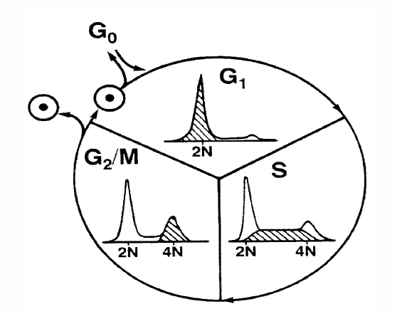
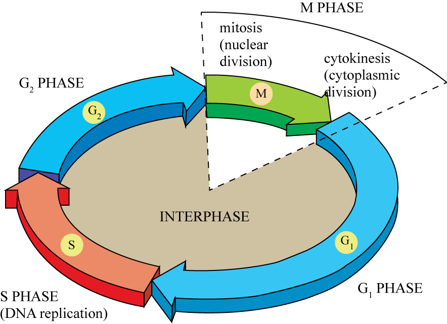
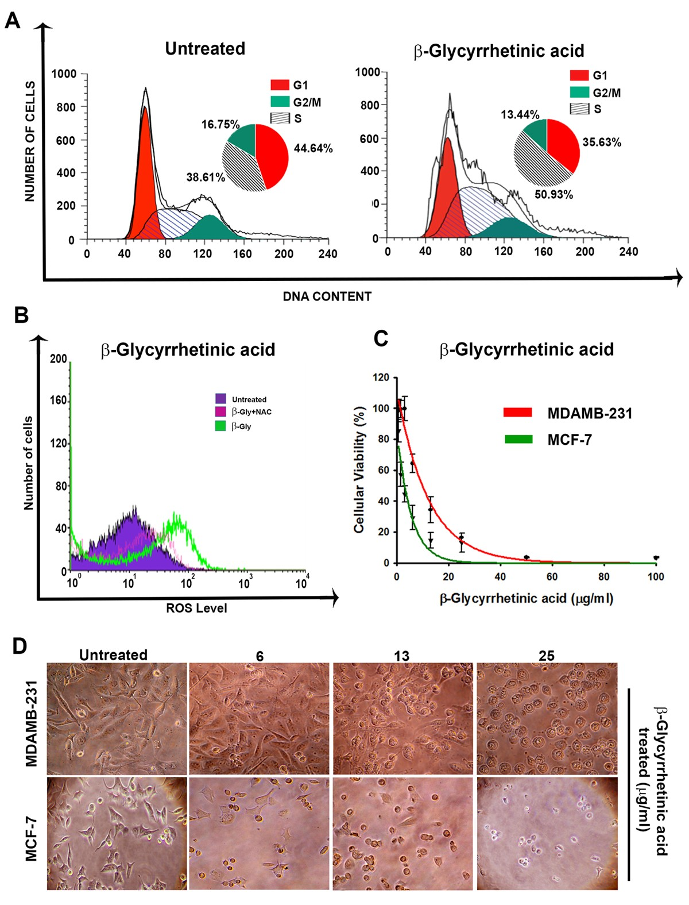

### Procedure

Reproduction of cells requires cell division, with production of two daughter cells. The most obvious cellular structure that requires duplication and division into daughter cells is the cell nucleus - the repository of the cell's genetic material, DNA. With few exceptions each cell in an organism contains the same amount of DNA and the same complement of chromosomes. Thus, cells must duplicate their allotment of DNA prior to division so that each daughter will receive the same DNA content as the parent. The cycle of increase in components (growth) and division, followed by growth and division of these daughter cells, is called the cell cycle. The two most obvious features of the cell cycle are the synthesis and duplication of nuclear DNA before division, and the process of cellular division itself - mitosis. These two components of the cell cycle are usually indicated in shorthand as the "S phase" and "mitosis" or "M". When the S phase and M phase of the cell cycle were originally described, it was observed that there was a temporal delay or gap between mitosis and the onset of DNA synthesis, and another gap between the completion of DNA synthesis and the onset of mitosis. These gaps were termed G1 and G2, respectively, giving the cycle G1 → S → G2 → M → G1.

<b>Figure 2: A schematic of the cell cycle, showing flow cytometric components of each phase</b>

When not in the process of preparing for cell division (most of the cells in our body are not), cells remain in the G1 portion of the cell cycle. The G1 phase is thus numerically the most predominant phase of the cell cycle and shows up as the largest peak. A subset of G1 cells which are very quiescent and have little of the cellular functions needed to enter the cell cycle are sometimes referred to as G0 cells. Some of the cellular processes which take place in the G1 and G2 phases of the cell cycle are now known. The G1 phase is a synthetic growth phase for many RNA and protein molecules that will be needed for DNA synthesis and cell growth before division. The G2 phase is a time for repair of any DNA damage which has occurred during the preceding cell cycle phases, and for the reorganization of the DNA structure which must take place before the DNA can be divided equally between daughters during mitosis. The length of these phases may vary between different cell types that are actively in the process of cell division. Typical time spans in which the cell is engaged in each of the phases of the cell cycle are 12 hours for G1, 6 hours for S phase, 4 hours for G2, and 0.5 hour for mitosis.

### Reagents, controls and safety (for cell-cycle DNA staining)

**Common DNA dyes**

- **Propidium iodide (PI):** intercalating dye; binds DNA and double-stranded RNA → use RNase to remove RNA signal. Requires membrane permeabilization/fixation (not suitable for live cells unless membrane-permeabilized).
- **DAPI, Hoechst 33342:** UV-excited; Hoechst 33342 can stain viable cells (useful for live cell DNA content analysis). Other dyes typically require permeabilization or fixation.

**Controls**

- Unstained control (autofluorescence baseline)
- Single-color controls (for compensation if measuring multiple colors)
- Isotype controls where appropriate (immunophenotyping)
- RNase-only and buffer blanks for DNA staining protocols

### Materials and reagents

- Cells in culture or single-cell suspension (1-5 × 106 cells per sample recommended)
- 70% cold ethanol (pre-chilled at -20 °C) — for fixation
- PBS (calcium/magnesium free)
- RNase A (DNase-free), 100 µg/mL working concentration
- Propidium iodide (PI) stock (1 mg/mL in water) → working concentration 50 µg/mL (final) typical (adjust per cell type)
- Optional: Triton X-100 (0.1%) for permeabilization (if needed)
- Flow cytometer with 488 nm laser (for PI; or UV for DAPI/Hoechst) and appropriate detector/filter (e.g., 610/20 for PI)

### Sample preparation

1. Harvest cells (adherent: trypsinize gently; suspension: centrifuge). Aim for 1-5 × 106 cells.
2. Wash twice with cold PBS to remove media/serum. Centrifuge 300 × g, 5 min.
3. Fix cells by dropwise addition of 4 volumes of ice-cold 70% ethanol while vortexing gently to avoid clumping. Final ethanol ~70%. Fix at -20 °C for ≥2 hours (or overnight). Ethanol fixation helps permeabilize cells for PI staining. (Note: solvent fixation can increase aggregation — be aware and use trituration.)
4. After fixation, wash cells twice with PBS to remove ethanol. Centrifuge 300 × g, 5 min.
5. Resuspend cells in PBS with RNase A (100 µg/mL) and incubate at 37 °C for 30 min to degrade RNA (important because PI binds RNA).
6. Add PI to a final concentration of ~50 µg/mL (typical starting point). Incubate 15-30 min at room temperature in the dark. Protect from light. (If using Hoechst/DAPI, adapt excitation/detection and permeabilization accordingly.)

### Acquisition on the cytometer

1. Instrument setup: run unstained and single-color controls first; check FSC/SSC to gate on the intact cell population and exclude debris.
2. Flow rate: use low flow for best resolution (DNA histograms require narrow CV).
3. Threshold: set threshold on FSC (or FSC + another parameter) to exclude small debris.
4. Events: collect at least 10,000-20,000 gated events (higher for better statistics; for clinical samples collect more). Aim for good peak shapes with CV < 5-7% for G1 if possible.
5. Pulse processing: record at least area (FL-A) and height (FL-H) or width (FL-W) for doublet discrimination.

### Doublet discrimination (to remove aggregates)

Use FL-A vs FL-H or FL-A vs FL-W gating to exclude doublets: single nuclei have characteristic area/height relationships; doublets have higher area but lower peak height relative to area. Create a gate for single events (diagonal gate) and analyze only single events for the DNA histogram. This is critical because doublets of G1 cells can mimic G2 signal.

### Histogram and model fitting

- Display a single-parameter histogram of PI area (DNA content). You should see a G1 peak (2N), S region (between G1 and G2), and G2/M peak (≈4N).
- Simple graphical methods: area-reflection or central-S extrapolation can be used for approximate S% estimation when histograms are ideal.
- Best practice — curve fitting / deconvolution: use the Dean & Jett model (Gaussian G1 and G2 + polynomial S phase) or Fox's synchronous-S variant for disturbed populations. Curve fitting with nonlinear least squares (Marquardt algorithm) is standard; software yields S, G1, G2 percentages and CVs. Use histogram-dependent debris and aggregation models for paraffin or damaged tissue.
- Quality metrics: CV of G1 peak (lower is better), %BAD (background aggregates and debris) and χ² goodness of fit (if software provides). Multicycle and similar packages provide sliced-nucleus debris and aggregation models that improve accuracy for paraffin/complex samples.

### Results and interpretation

- Typical asynchronous mammalian cultured cells: G1 ≫ S (e.g., G1 50-70%, S 10-30%, G2 5-20%) depending on cell type and culture conditions. The S peak is broad and overlaps G1 and G2; modeling is required for accurate S%.
- Watch for broad G1 CV, high debris, or high aggregate fraction — these reduce reliability of S estimates; apply debris/aggregation models as needed.
- MDA-MB-231 cells treated with anti-cancer compound indicate disturbance of cell-cycle phases (Figure 3). In untreated cells, the percentage of cells in the G1 phase was 45.22 ± 2.63%, that in the S phase was 39.44 ± 1.85% and G2/M phase was 15.34 ± 0.76%. Treatment of MDA-MB-231 cells with anti-cancer compound produced a cell cycle phase distribution as follows: 35.63 ± 1.37% cells in G1 phase, 50.93 ± 1.67% cells in S phase and 13.44 ± 0.56% cells in G2/M phase. Thus, there is an extensive arrest of MDA-MB-231 cells in S phase on treatment with the anti-cancer compound (Figure 3).

<b>Figure 3: Cell-cycle stages of MDA-MB-231 cells treated with anti-cancer drug.</b>

