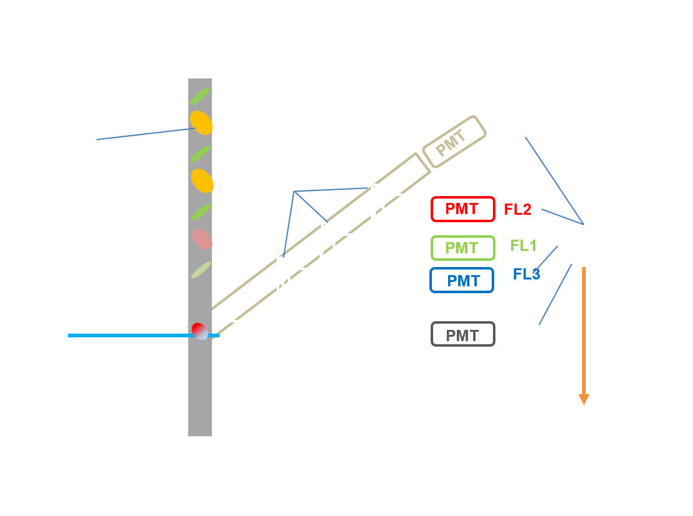

Flow cytometry is a powerful analytical technique used to rapidly measure multiple physical and chemical characteristics of individual cells or particles suspended in a fluid stream. As cells pass single-file through a focused laser beam, they scatter light and emit fluorescence that reflects their size, internal complexity, and molecular composition. Modern flow cytometers can analyze thousands of cells per second and quantify dozens of parameters simultaneously, making the technique indispensable for immunology, hematology, microbiology, cancer biology, and clinical diagnostics. Flow cytometry enables the analysis of heterogeneous populations and provides high-resolution, quantitative information on cell phenotype, function, proliferation, cell cycle distribution, apoptosis, signalling pathways, and more. When equipped with sorting capability (FACS), the instrument can physically isolate specific cell subsets for downstream applications such as culture, molecular assays, genomics, or proteomics.

Flow cytometry is a standard laser-based technology that is used in the detection and measurement of physical and chemical characteristics of cells or particles in a heterogeneous fluid mixture (Figure 1). The properties that can be measured by this process include a particle's size, granularity or internal complexity, and fluorescence intensity. These characteristics are determined using an optical-to-electronic coupling system that detects the cells based on laser light scattered by the cells. Cell components are fluorescently labelled and then excited by the laser to emit light at varying wavelengths. The fluorescence can then be measured to determine the amount and type of cells present in a sample. Up to thousands of particles per second can be analysed as they pass through the liquid stream.

A beam of laser light is directed at a hydrodynamically-focused stream of fluid that carries the cells. Several detectors are carefully placed around the stream, at the point where the fluid passes through the light beam. One of these detectors is in line with the light beam and is used to measure Forward Scatter (FSC). Another detector is placed perpendicular to the stream and is used to measure Side Scatter (SSC). Since fluorescent labels are used to detect the different cells or components, fluorescent detectors are also in place. The suspended particles or cells, which may range in size from 0.2 to 150 μm, pass through the beam of light and scatter the light beams. The fluorescently labelled cell components are excited by the laser and emit light at a longer wavelength than the light source. This is then detected by the detectors. The detectors therefore pick up a combination of scattered and fluorescent light. This data is then analyzed by a computer that is attached to the flow cytometer using special software. The brightness of each detector (one for each fluorescent emission peak) is adjusted for this detection. Using the light measurements, different information can be gathered about the physical and chemical structure of the cells. Generally, FSC can detect the cell volume whereas the SSC reflects the inner complexity of the particle such as its cytoplasmic granule content or nuclear structure.

<b>Figure 1: Schematic diagram of flow cytometer</b>

### 2. Basic Principle

The principle of flow cytometry is based on the measurement of light signals generated as cells flow in a narrow, hydrodynamically focused stream through one or more laser beams.

#### 2.1 Hydrodynamic Focusing

A cell suspension is injected into a rapidly flowing sheath fluid. Differences in fluid velocity cause the sample to be focused into a narrow core stream so that cells pass through the laser one at a time.

#### 2.2 Interaction with Laser Light

As each cell intersects the laser beam, two primary types of signals are generated:

- **Light scatter**
  - **Forward Scatter (FSC):** Proportional to cell size.
  - **Side Scatter (SSC):** Related to internal complexity or granularity.
- **Fluorescence**
  - Fluorochrome-labeled antibodies, DNA-binding dyes (e.g., PI, DAPI), calcium indicators, and fluorescent proteins (e.g., GFP) emit light at specific wavelengths when excited by the laser.
  - Emitted fluorescence intensity reflects the amount of bound fluorochrome, which correlates with target molecule expression or cell function.

#### 2.3 Signal Detection and Processing

Collected light is directed through optical filters onto detectors (e.g., photomultiplier tubes). These detectors convert photons into electrical pulses which are:

- **Amplified** (linear or logarithmic),
- **Converted to digital values**, and
- **Stored as events** in standard FCS files for analysis.

Each event (cell) is represented by multiple parameters, such as FSC, SSC, and fluorescence intensities for each detector channel.

#### 2.4 High-speed Multiparametric Measurement

By rapidly sampling thousands of cells per second, the system generates statistically robust, multiparametric datasets that allow identification of cell populations, quantification of marker expression, and detailed cell state analyses (e.g., cell cycle, apoptosis, activation).

### 3. Instrumentation - the three core systems

A flow cytometer comprises three integrated subsystems: **fluidics, optics, electronics**.

#### 3.1 Fluidics (sample delivery and hydrodynamic focusing)

- Purpose: carry single-file particles to the laser intercept. Sample is injected into sheath fluid producing a sample core focused by hydrodynamic focusing so cells pass one at a time.
- Flow rate considerations: higher flow rate → faster acquisition but poorer resolution (wider core); lower flow rate → better resolution (narrower core) and preferred for DNA/cell-cycle analysis. Benchtop cytometers often have LO/MED/HI settings; stream-in-air instruments allow fine adjustments.
- Practical checks: ensure no bubbles, stable sheath pressure, and appropriate sample pressure.

#### 3.2 Optics (excitation and collection)

- Lasers provide excitation (e.g., 488 nm argon for FITC/PE excitation; 635 nm red diode for red dyes). Emitted/scattered light is collected by lenses, split with dichroic mirrors and passed through filters (bandpass, longpass, shortpass) to detectors. Example: FITC detector often uses 530/30 bandpass.
- Forward scatter is typically collected on a photodiode; SSC and fluorescence are often measured with photomultiplier tubes (PMTs).

#### 3.3 Electronics (signal processing and digitization)

- PMTs/photodiodes convert photons → electrical pulses; amplifiers (linear/log) shape the signal; ADC converts voltage pulses to digital channels (analog systems 0-1000 channels; modern digital systems up to 16,384 levels).
- Thresholds: set to exclude debris (e.g., FSC threshold) so only events above threshold are processed. Some instruments allow two thresholds (dual-parameter).

### 4. Data Analysis

Flow cytometry data analysis involves extracting meaningful biological information from the fluorescence and scatter signals recorded for each event (cell). Data are stored as **FCS files**, which include both the numeric parameter values (FSC, SSC, fluorescence channels) and experiment metadata.

#### 4.1 Gating strategy

Analysis begins with applying **gates** to identify the cell population of interest:

- **FSC vs SSC gate** to exclude debris and isolate the main cell population.
- Additional gates (e.g., FSC-A vs FSC-H) remove **doublets**, ensuring only single cells are analyzed.

#### 4.2 Fluorescence quantification

Within the gated population, fluorescence histograms or dot plots are used to identify positive and negative populations. Values typically reported include:

- **% gated**
- **Mean Fluorescence Intensity (MFI)**
- **Median fluorescence**

#### 4.3 Compensation

Because many fluorochromes have **overlapping emission spectra**, compensation is used to subtract spillover between detectors. Single-color controls and proper optical filter selection are essential for accurate quantification.
